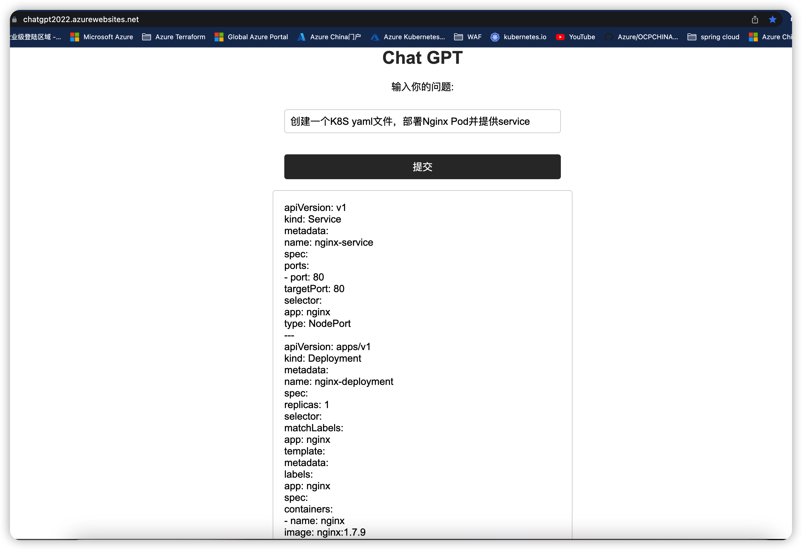

# 使用 ChatGPT API 构建智能聊天机器人并将并部署到 Azure App Service 和Microsoft Teams App

## 方案简介
[ChatGPT](https://openai.com/blog/chatgpt/) 是一个使用 GPT-3（Generative Pre-trained Transformer 3）自然语言处理模型构建的机器人聊天系统。它可以接受用户输入并使用 GPT-3 模型生成回复。它使用了大量的文本数据来预先训练语言模型，以便在不同的任务中使用。GPT-3 模型具有很强的自然语言生成能力，可以生成人类可以理解的语言文本。

ChatGPT API 可以通过 HTTP 调用访问，可以使用多种语言（包括 Python、Java、JavaScript 和 Ruby）调用。你可以通过向 API 发送文本提示并获取回复来使用 ChatGPT。你可以使用 ChatGPT API 构建一个智能聊天机器人，也可以将它用于其他自然语言生成应用。本文演示使用Python语言实现ChatGPT API 调用并部署到Azure App Service和Microsoft Teams App展现用户交互界面。

## 准备工作

要部署ChatGPT API，需要准备以下几项：

- Azure订阅
- Python 3.10或更高版本(本demo使用Python 3.10.9)
- 安装[Azure CLI](https://docs.microsoft.com/zh-cn/cli/azure/install-azure-cli?view=azure-cli-latest)
- 安装[Azure App Service插件](https://docs.microsoft.com/zh-cn/cli/azure/ext/appservice/web/cli-azure-ext-appservice-web?view=azure-cli-latest)
- 要使用 ChatGPT API，需要先注册[OpenAI 开发者账号](https://beta.openai.com/signup)并获取 [API 密钥](https://beta.openai.com/account/api-keys)。


## 程序设计逻辑

### 设计架构的工作原理如下：

1. 用户在 Web 页面中输入文本并单击按钮。

2. Web 页面使用 JavaScript 将文本发送到 Flask 应用程序的 /chat 路由。

3. Flask 应用程序接收文本并使用 ChatGPT 生成回复文本。

4. Flask 应用程序将回复文本发送回 Web 页面。

5. Web 页面使用 JavaScript 将回复文本显示在页面上。

在这种架构中，index.html 文件是 Web 页面的模板。在该文件中，我们使用 HTML 和 CSS 来创建页面布局和外观。我们还使用 JavaScript 来处理用户交互并与 Flask 应用程序进行通信。

Flask 应用程序文件 (上面的代码) 负责处理用户输入的文本并生成回复。它还提供了两个路由：一个用于显示 Web 页面，另一个用于处理用户输入的文本并生成回复。

在静态文件目录中，我们可以存储 CSS 样式表和 JavaScript 文件。这些文件可以用来自定义 Web 页面的外观和交互。

总之，这种设计架构将 Web 页面、Flask 应用程序和 OPenAI API 结合起来，使用户能够通过 Web 页面与 ChatGPT 聊天机器人进行交互。

### Python代码解析
下面是使用两个 Python 程序（server.py 和 gpt.py）调用 OpenAI API 并生成 Flask 交互式 Web 页面的代码。

这种设计架构可以使代码更易于维护和扩展，


在下面的代码中，server.py 文件是 Flask 应用程序文件。它负责提供 Web 页面和与 ChatGPT 聊天机器人进行交互的路由。

server.py：

```Python server.py
from flask import Flask, request
import gpt

app = Flask(__name__)

@app.route('/process_gpt', methods=['POST'])
def process_gpt():
  return gpt.process_gpt(request)

@app.route('/')
def index():
  return app.send_static_file('index.html')

if __name__ == '__main__':
  app.run()
```

gpt.py 文件是 ChatGPT 类的定义。它包含一个静态方法，用于生成 ChatGPT 的回复文本。

gpt.py：

```Python gpt.py
import openai

def process_gpt(request):
  message = request.form['message']
  openai.api_key = "<YOUR_API_KEY>"
  response = openai.Completion.create(
    engine="text-davinci-003",
    prompt=message,
    max_tokens=1024,
    temperature=0.5,
  )

  # Format the response text
  response_text = response.choices[0].text.strip()  # Remove leading and trailing whitespace
  response_text = response_text.replace("\n", "<br>")  # Replace newlines with line breaks
  # Return the formatted response text
  return response_text
```

1. gpt.py中使用 **openai.api_key = "<YOUR_API_KEY>"** 来输入API Key，用你实际申请的API Key 替换程序中<YOUR_API_KEY>。

2. openai.Completion.create() 方法来调用 OpenAI API。这个方法接受多个参数，包括：

 - engine：要使用的 GPT-3 模型。
 - prompt：聊天对话的上下文。这里，我们通过用户的输入问题来实现通用的对话，没有对bot给出特殊提示。大家可以根据实际的应用在自己的项目中设置prompt。例如： prompt="User: Hi, how are you today?\nBot:"
 - max_tokens：生成的回复的最大字符数。
 - temperature：生成的回复的随机性。值越大，回复越随机。
 - 更多该方法的参数及解释可以[参考openai.Completion.create() 方法官方文档](https://beta.openai.com/docs/api-reference/completions/create)


1. 调用 OpenAI API 后，会返回一个包含生成的回复的响应。你可以使用 response.text 属性来获取回复的文本。你可以将这个回复文本作为机器人的回复，并将其显示给用户。

## 部署 Python Web 应用到 Azure App Service
现在，你已经知道了如何使用 ChatGPT API 构建一个智能聊天机器人。接下来，你可能希望将你的 Python web 应用部署到 Azure App Service 上。

要部署你的应用到 Azure App Service，你需要先注册 Azure 帐户并创建一个 App Service 计划。然后，你可以使用 Azure 门户或 Azure CLI 来创建一个新的 App Service 应用。

你还需要准备你的应用代码和任何依赖项。这可以通过将代码打包成 zip 文件来完成。

最后，你可以使用 Azure 门户或 Azure CLI 上传 zip 文件并启动你的应用。

例如，你可以使用 Azure CLI 命令 az webapp deployment source config-zip 来配置 zip 文件来作为部署来源：

```bash
az webapp deployment source config-zip --resource-group myResourceGroup --name myApp --src myapp.zip
```

这样，你的应用就会被部署到 Azure App Service 上，并可以通过 Internet 访问。


## 结论

本文介绍了如何将ChatGPT API部署到Azure App Service上，以及如何使用该API。使用Azure App Service可以轻松地将ChatGPT API部署到云中，从而可以在任何地方使用该API。